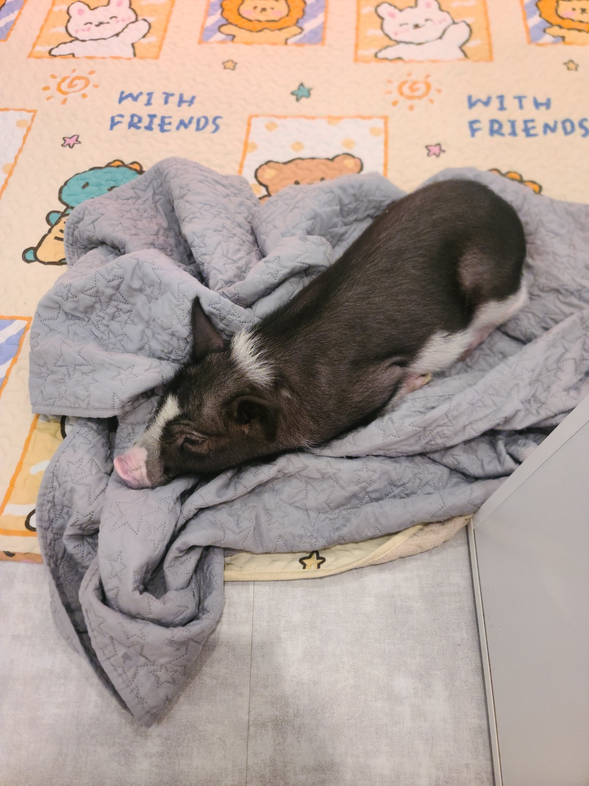
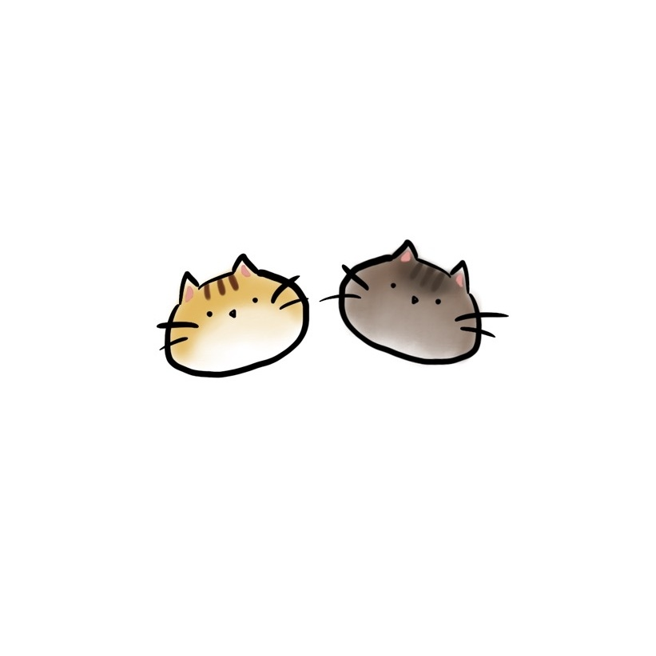

# MUDIUM
| 뮤지컬 커뮤니티

## 🤝TEAM
| ||||| |
| :------------------------------------: | :-------------------------------------: | :-----------------------------------: | :--------------------------------------: | :-----------------------------------: | :------------------------------------------: |
| [🦖김시우](https://github.com/siu98) | [🐰이효진](https://github.com/jinjin0528) | [😇김서현](https://github.com/1etterh) | [👀이우진](https://github.com/Vorschlag-bit) | [😺김동혁](https://github.com/dongkh9) | [🐶김정모](https://github.com/mojeeeeong) |

## 🛠️기술스택

## 📢협업 툴

## 📋전체 프로젝트 일정
**프로젝트 일정 : 2024년 10월 14일 ~ 2024년 10월 21일**

### 목차

- [1. 프로젝트 개요](#1-프로젝트-개요)
- [2. 요구사항 명세서](#2-요구사항-명세서)
- [3. WBS](#3-WBS)
- [4. DDD](#4-DDD)
- [5. DB 모델링](#5-DB-모델링)
- [6. UI 설계](#6-UI-설계)
- [7. CI/CD 파이프라인](#7-CI-CD-파이프라인)
- [8. 프론트엔드 및 백엔드 테스트 결과](#8-프론트엔드-백엔드-테스트-결과)
- [9. CI/CD 테스트 결과](#9-CI-CD-테스트-결과)
- [10. 팀 회고](#10-팀-회고)

---
## 🍀1. 프로젝트 개요

뮤지컬 관련 정보를 확인하고 공유하며 소통하는 커뮤니티입니다.

### 1.1 프로젝트 소개

**뮤지컬에 대해 자유롭게 정보를 공유하고 소통해보세요.**

- ✔️ 관람했던 뮤지컬 티켓을 온라인으로 소장해보세요.
- ✔️ 다른 사람들이 좋아하는 뮤지컬을 확인해보세요.
- ✔️ 뮤지컬 리뷰를 확인하고 공유해보세요.

---

### 1.2 프로젝트 배경

뮤지컬 산업은 최근 몇 년간 빠르게 성장하며, 많은 관객들이 뮤지컬에 대한 정보를 찾고 소통하고자 하는 수요가 높아지고 있습니다. 그러나 기존의 정보 제공 플랫폼은 사용자가 뮤지컬에 대해 자유롭게 논의하고 소통할 수 있는 커뮤니티 기능이 부족한 상황입니다. 이에 따라, 뮤지컬을 사랑하는 사람들이 한데 모여 정보 공유, 리뷰 작성, 티켓 소장 등 다양한 활동을 할 수 있는 공간을 마련하고자 이 프로젝트를 기획하게 되었습니다.

---

### 1.3 국내외 유사 서비스와 차별성

#### 1.3.1 플레이DB
국내 대표적인 공연 정보 제공 서비스로, 뮤지컬 정보와 리뷰를 제공하지만, 커뮤니티 기능이 제한적입니다.

#### 1.3.2 뮤지컬 커뮤니티
뭐적어야하지

## 🍀2. 요구사항 명세서

   

---

## 🍀3. WBS

---

## 🍀4. DDD

---

## 🍀5. DB 모델링

---

## 🍀6. UI 설계

---

## 🍀7. CI/CD 파이프라인

---

## 🍀8. 프론트엔드 및 백엔드 테스트 결과

---

## 🍀9. CI/CD 테스트 결과

---

## 🍀10. 팀 회고
#### 김시우
> **이효진**:
> 

> **김서현**: 
> 

> **이우진**: 
> 

> **김동혁**:
>

> **김정모**:
> 

